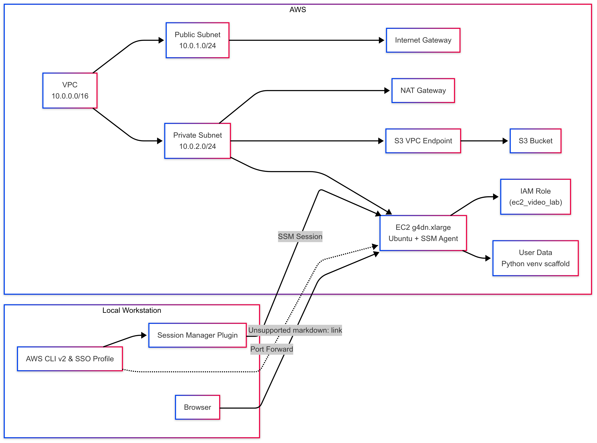

# Terraform AI Image Lab – Personal Infrastructure Showcase

<p align="center">
  
</p>


> ✅ This project was designed and built as a personal technical showcase of AWS cloud infrastructure, Terraform automation, and GPU-backed EC2 provisioning for AI use cases.

---

## 🧠 What This Project Demonstrates

This repo showcases a full-stack, production-style cloud environment that I built and deployed using Terraform. The purpose was to launch a GPU-enabled EC2 instance running an AI image generation model (Stable Diffusion), store outputs securely in S3, and provision all infrastructure using Infrastructure as Code (IaC).

This project is not meant as a plug-and-play tool, but as proof of my cloud architecture, security, and automation capabilities.

---

## 🔧 Technologies & Concepts Demonstrated

- **Terraform (modularized)** for automated AWS provisioning
- **AWS VPC Design**: public + private subnets, NAT Gateway, route tables
- **IAM Role Scoping**: EC2 instance role with least-privilege S3 + SSM access
- **AWS SSO** for secure authentication and access
- **Private EC2 instance** (g4dn.xlarge) with GPU
- **SSM Session Manager** used in place of SSH
- **Stable Diffusion (AUTOMATIC1111)** manual install on EC2
- **S3 VPC Endpoint** for private uploads

---

## 📂 Repo Structure

```bash
terraform/
├── main.tf
├── variables.tf
├── terraform.tfvars
├── outputs.tf
└── modules/
    ├── vpc/
    ├── iam/
    ├── s3/
    └── compute/
run_sd_webui.sh   # Optional script for Stable Diffusion WebUI launch
```

---

## 🛠 Deployment Overview

<p align="center">
  
</p>


1. **SSO Authentication** (used for Terraform CLI access):
   ```bash
   aws sso login --profile my-sso-profile
   export AWS_PROFILE=my-sso-profile
   ```

2. **Provision Infrastructure**:
   ```bash
   cd terraform/
   terraform init
   terraform apply
   ```

3. **SSM Into EC2** (no SSH required):
   ```bash
   aws ssm start-session --target <instance-id>
   ```

4. **Install Stable Diffusion (one-time, inside EC2)**:
   ```bash
   sudo apt update
   sudo apt install git python3-venv -y
   git clone https://github.com/AUTOMATIC1111/stable-diffusion-webui.git
   cd stable-diffusion-webui
   python3 -m venv venv
   source venv/bin/activate
   ./webui.sh --listen
   ```

5. **Access the WebUI (via port forwarding):**
   ```bash
   aws ssm start-session --target <instance-id>      --document-name AWS-StartPortForwardingSession      --parameters '{"portNumber":["7860"], "localPortNumber":["7860"]}'
   ```
   Open `http://localhost:7860` in your browser.

6. **Upload Images to S3 (manual or script):**
   ```bash
   aws s3 cp output.png s3://your-bucket-name/
   ```

   ## ⚠️ Stable Diffusion Setup Disclaimer

The instructions provided here are a simplified setup based on my environment and goals.

For the most accurate and up-to-date installation steps, please refer to the official repository:

🔗 [AUTOMATIC1111/stable-diffusion-webui](https://github.com/AUTOMATIC1111/stable-diffusion-webui)

> Note: GPU driver support, Python versions, and dependency issues may vary depending on your EC2 instance or OS version.

---

## 🔐 Security Best Practices Followed

- No public IPs exposed
- EC2 lives in a private subnet
- SSH disabled; only SSM allowed
- IAM access is scoped and role-based
- S3 VPC endpoint for secure internal uploads

---

## 🎯 Use Case

This project was built for:
- Showcasing real AWS architecture skills
- Practicing secure deployment workflows
- Demonstrating IaC, SSO, and container runtime setups in a real scenario

---

## 📘 Notes

This is a personal portfolio project. All AWS access keys are excluded.  
If you'd like to adapt this project, feel free to fork and modify — but it is not packaged for immediate reuse.

## License

MIT License
